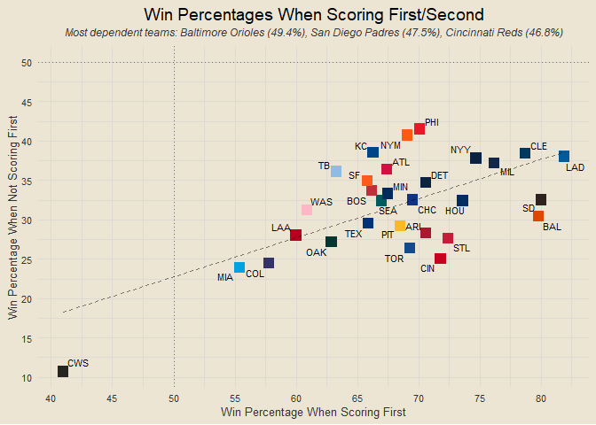
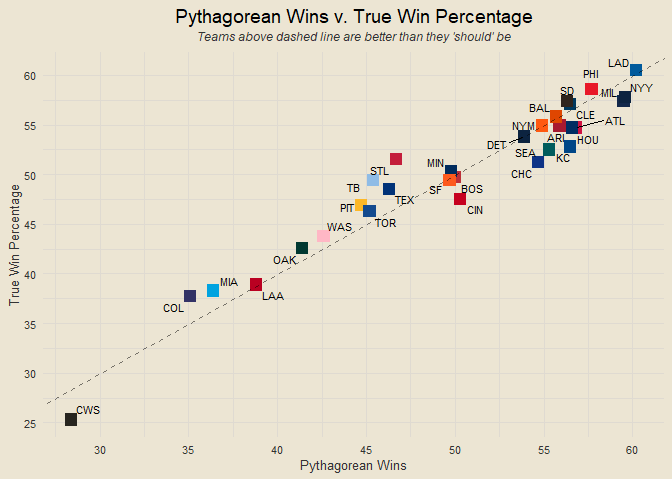
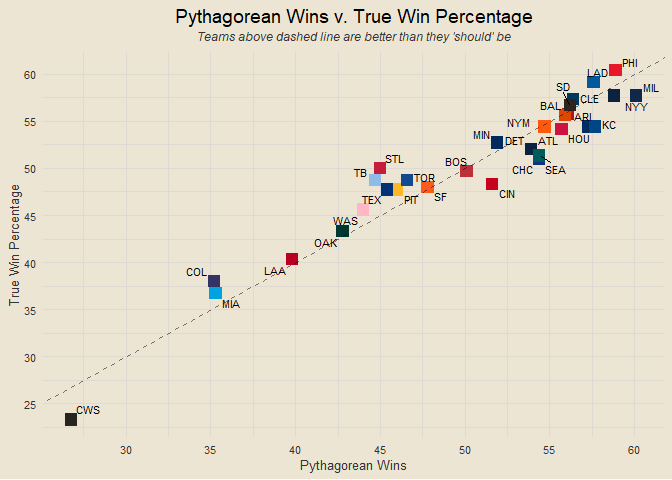

Chad’s 2024 MLB Report
================

### Contents

- [Team Standings](#team-standings)
- [Team NPR](#team-npr)
- [Total NPR Rankings](#total-npr-rankings)
- [Offensive NPR Rankings](#offensive-npr-rankings)
- [Defensive NPR Rankings](#defensive-npr-rankings)
- [Scorigami](#scorigami)
- [Yesterday’s Largest Victories](#yesterdays-largest-victories)
- [Team Volatility](#team-volatility)
- [Runs Scored per Game](#runs-scored-per-game)
- [One-Run Games](#one-run-games)
- [NPR and Win Percentage](#npr-and-win-percentage)
- [Best Records in Last Ten Games](#best-records-in-last-ten-games)
- [Early Leads](#early-leads)
- [First Score Dependence](#first-score-dependence)
- [Home Field Advantage](#home-field-advantage)
- [Winning and Losing Streaks](#winning-and-losing-streaks)
- [Seven Game Windows](#seven-game-windows)
- [Team Margins in Seven Game
  Windows](#team-margins-in-seven-game-windows)
- [Team Series Results](#team-series-results)

------------------------------------------------------------------------

### Team Standings

<!-- -->

------------------------------------------------------------------------

### Team NPR

<!-- -->

**What is NPR?**

NPR, Naive Performance Rating, is a metric I devised as a measure of
team performance above/below expected. The logic behind it is this: I
calculate each team’s expected runs scored in each game by taking the
average of their runs scored per game and their opponent’s runs allowed
per game. I then compare this expected value to the actual value of runs
scored or allowed to calculate each team’s offensive and defensive NPR
for each game. Here is an example.

Suppose the Cubs are playing the Cardinals. Let’s say the Cubs, on
average, score 4.5 runs per game and allow 3.25 runs per game. And let’s
say the Cardinals score 3.75 runs per game and allow 2.75 runs per game.
We calculate the Cubs’ expected run value as the average of their runs
scored per game and the Cardinals’ runs allowed per game, so (4.5 +
2.75) / 2 = 3.63. We would calculate the Cardinals’ expected run value
the same way, so (3.75 + 3.25) / 2 = 3.5. We now have the Cubs’ expected
run value as 3.63 and the Cardinals’ expected run value as 3.5.

Suppose that the final score of the game is a Cubs victory, 5-3. We
would calculate the Cubs’ offensive NPR as their actual score minus
their expected score: 5 - 3.63 = 1.37. We would calculate their
defensive NPR as the Cardinals’ expected score minus their actual score:
3.5 - 3 = 0.5 (we do it in this order so positive values are good). For
the Cardinals, their offensive NPR is their actual score minus their
expected score, 3 - 3.5 = -0.5, and their defensive NPR is the Cubs’
expected score minus their actual score, 3.63 - 5 = -1.37. Notice how
these numbers are opposite each other. So each team will have an
offensive and defensive NPR for each game, which are aggregated in the
plot below.

Of course, there are so many other factors that would play into a team’s
true expected value, such as any injuries, starting pitchers, weather,
and more. That is why I have named it Naive Performance Rating, because
it assumes matchup metrics are independent of each other and does not
take external factors into account. Which, of course, will lead to flaws
in the metric, but is done for the sake of simplicity and
interpretability (which is ironic because I expect it is still difficult
to interpret for others than myself).

------------------------------------------------------------------------

### Total NPR Rankings

<!-- -->

------------------------------------------------------------------------

### Offensive NPR Rankings

<!-- -->

------------------------------------------------------------------------

### Defensive NPR Rankings

<!-- -->

------------------------------------------------------------------------

### Scorigami

<!-- -->

------------------------------------------------------------------------

### Yesterday’s Largest Victories

1.  Cincinnati Reds def. Colorado Rockies 13-3
2.  Baltimore Orioles def. Toronto Blue Jays 7-2
3.  Houston Astros def. St. Louis Cardinals 7-4

------------------------------------------------------------------------

### Team Volatility

<!-- -->

##### Most Volatile Teams

1.  Oakland Athletics (6.83)
2.  Arizona Diamondbacks (6.77)
3.  Colorado Rockies (6.67)

##### Most Volatile Offenses

1.  Arizona Diamondbacks (3.74)
2.  Texas Rangers (3.49)
3.  San Diego Padres (3.44)

##### Most Volatile Defenses

1.  Miami Marlins (3.63)
2.  Colorado Rockies (3.61)
3.  Los Angeles Angels (3.51)

------------------------------------------------------------------------

### Runs Scored per Game

<!-- -->

------------------------------------------------------------------------

### One-Run Games

<!-- -->

------------------------------------------------------------------------

### NPR and Win Percentage

<!-- -->

------------------------------------------------------------------------

### Best Records in Last Ten Games

1.  Baltimore Orioles (8-2)
2.  New York Yankees (8-2)
3.  Cincinnati Reds (7-3)
4.  Cleveland Guardians (7-3)
5.  Detroit Tigers (7-3)
6.  Milwaukee Brewers (7-3)
7.  Minnesota Twins (7-3)
8.  Seattle Mariners (7-3)
9.  St. Louis Cardinals (6-4)
10. Colorado Rockies (5-5)

------------------------------------------------------------------------

### Early Leads

<!-- -->

------------------------------------------------------------------------

### First Score Dependence

<!-- -->

------------------------------------------------------------------------

### Home Field Advantage

<!-- -->

##### Most Home-Dependent Teams

- Seattle Mariners (65.6% home / 44.8% away)
- Colorado Rockies (46.4% home / 25.8% away)
- Kansas City Royals (67.7% home / 48.3% away)

##### Better-on-the-Road Teams

- San Diego Padres (40.6% home / 61.3% away)
- Los Angeles Angels (27.6% home / 45.2% away)
- Boston Red Sox (43.3% home / 56.7% away)

------------------------------------------------------------------------

### Winning and Losing Streaks

- **Winning Streaks**: New York Yankees (W5), Arizona Diamondbacks (W3),
  Seattle Mariners (W3), Cincinnati Reds (W2), Detroit Tigers (W2), Los
  Angeles Dodgers (W2)
- **Losing Streaks**: Chicago White Sox (L11), San Francisco Giants
  (L5), Colorado Rockies (L3), Miami Marlins (L2), San Diego Padres (L2)

<!-- ___ -->
<!-- ### Day of Week Results -->
<!-- ```{r echo = F} -->
<!-- days_of_week = c("Sunday", "Monday", "Tuesday", "Wednesday", "Thursday", "Friday", "Saturday") -->
<!-- ``` -->
<!-- ##### Winners -->
<!-- - -->
<!-- ##### Losers -->
<!-- - -->

------------------------------------------------------------------------

### Seven Game Windows

<!-- -->

------------------------------------------------------------------------

### Team Margins in Seven Game Windows

<!-- -->

------------------------------------------------------------------------

### Team Series Results

<!-- -->

------------------------------------------------------------------------

*Interested in the underlying code that builds this report?* Check it
out on GitHub:
<a href="https://github.com/chadallison/mlb24" target="_blank">mlb24</a>

``` r
end_pct = end_games |>
  inner_join(team_records |>
  distinct(team, pct), by = c("home_team" = "team")) |>
  rename(home_pct = pct) |>
  inner_join(team_records |>
  distinct(team, pct), by = c("away_team" = "team")) |>
  rename(away_pct = pct)

get_win_pct_above_500 = function(team) {
  data = end_pct |>
    filter(home_team == team | away_team == team) |>
    mutate(opp_pct = ifelse(home_team == team, away_pct, home_pct)) |>
    filter(opp_pct >= 50)
  
  games = nrow(data)
  wins = data |> filter(win_team == team) |> nrow()
  
  return(round(wins / games * 100, 1))
}

get_win_pct_below_500 = function(team) {
  data = end_pct |>
    filter(home_team == team | away_team == team) |>
    mutate(opp_pct = ifelse(home_team == team, away_pct, home_pct)) |>
    filter(opp_pct < 50)
  
  games = nrow(data)
  wins = data |> filter(win_team == team) |> nrow()
  
  return(round(wins / games * 100, 1))
}

data.frame(team = all_teams) |>
  mutate(above_500_pct = sapply(team, get_win_pct_above_500),
         below_500_pct = sapply(team, get_win_pct_below_500)) |>
  inner_join(teams_info, by = "team") |>
  ggplot(aes(below_500_pct, above_500_pct)) +
  geom_point(aes(col = team), size = 4, shape = "square", show.legend = F) +
  geom_hline(yintercept = 50, linetype = "dashed", alpha = 0.5) +
  geom_vline(xintercept = 50, linetype = "dashed", alpha = 0.5) +
  scale_color_manual(values = team_hex) +
  ggrepel::geom_text_repel(aes(label = abb), size = 3) +
  labs(x = "Win Percentage vs. Below .500 Opponents",
       y = "Win Percentage vs. Above .500 Opponents",
       title = "Win Percentage vs. Above/Below .500 Opponents") +
  scale_x_continuous(breaks = seq(0, 100, by = 5)) +
  scale_y_continuous(breaks = seq(0, 100, by = 5))
```

<!-- -->
