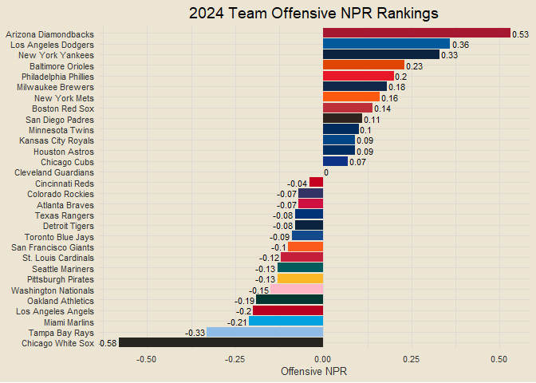
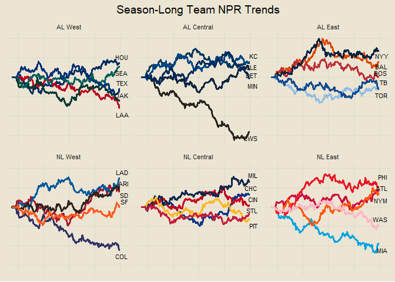
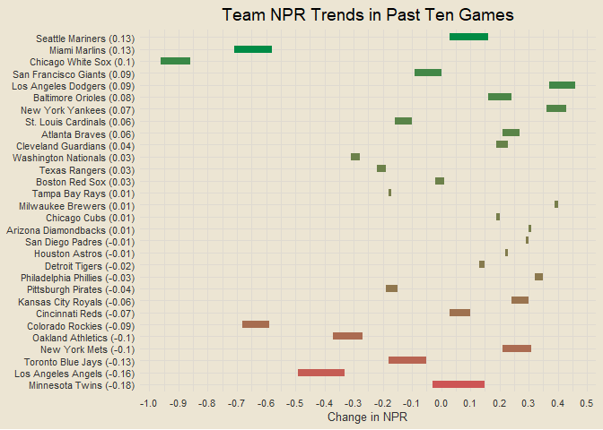
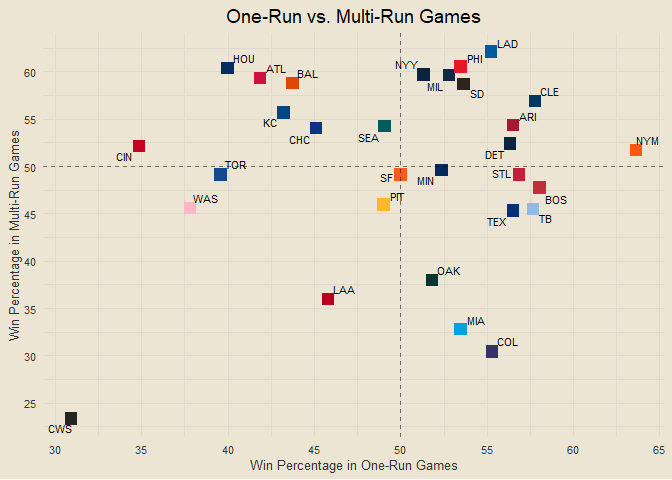

Chad’s 2024 MLB Report
================

*Interested in the underlying code that builds this report?* Check it
out on GitHub:
<a href="https://github.com/chadallison/mlb24" target="_blank">mlb24</a>

------------------------------------------------------------------------

### Contents

- [Team Standings](#team-standings)
- [Team NPR](#team-npr)
- [Total NPR Rankings](#total-npr-rankings)
- [Offensive NPR Rankings](#offensive-npr-rankings)
- [Defensive NPR Rankings](#defensive-npr-rankings)
- [Scorigami](#scorigami)
- [Yesterday’s Largest Victories](#yesterdays-largest-victories)
- [Team Volatility](#team-volatility)
- [Runs Scored per Game](#runs-scored-per-game)
- [One-Run Games](#one-run-games)
- [NPR and Win Percentage](#npr-and-win-percentage)
- [Best Records in Last Ten Games](#best-records-in-last-ten-games)
- [Early Leads](#early-leads)
- [First Score Dependence](#first-score-dependence)
- [Home Field Advantage](#home-field-advantage)
- [Winning and Losing Streaks](#winning-and-losing-streaks)
- \[Seven Game Windows\]
- \[Team Series Results\]
- [Records vs. Above/Below .500
  Teams](#records-vs.-abovebelow-.500-teams)
- [Pythagorean Wins](#pythagorean-wins)
- [Season Long NPR Trends](#season-long-npr-trends)
- \[Season Long Pythagorean Trends\]
- [Runs Scored and Allowed Streaks](#runs-scored-and-allowed-streaks)
- [Team NPR Trends in Past Ten
  Games](#team-npr-trends-in-past-ten-games)
- [First Inning Score Rates](#first-inning-score-rates)
- [One Run vs. Multi Run Games](#one-run-vs.-multi-run-games)
- [Rolling Ten-Game Windows](#rolling-ten-game-windows)

------------------------------------------------------------------------

### Team Standings

<!-- -->

------------------------------------------------------------------------

### Team NPR

<!-- -->

**What is NPR?**

NPR, Naive Performance Rating, is a metric I devised as a measure of
team performance above/below expected. The logic behind it is this: I
calculate each team’s expected runs scored in each game by taking the
average of their runs scored per game and their opponent’s runs allowed
per game. I then compare this expected value to the actual value of runs
scored or allowed to calculate each team’s offensive and defensive NPR
for each game. Here is an example.

Suppose the Cubs are playing the Cardinals. Let’s say the Cubs, on
average, score 4.5 runs per game and allow 3.25 runs per game. And let’s
say the Cardinals score 3.75 runs per game and allow 2.75 runs per game.
We calculate the Cubs’ expected run value as the average of their runs
scored per game and the Cardinals’ runs allowed per game, so (4.5 +
2.75) / 2 = 3.63. We would calculate the Cardinals’ expected run value
the same way, so (3.75 + 3.25) / 2 = 3.5. We now have the Cubs’ expected
run value as 3.63 and the Cardinals’ expected run value as 3.5.

Suppose that the final score of the game is a Cubs victory, 5-3. We
would calculate the Cubs’ offensive NPR as their actual score minus
their expected score: 5 - 3.63 = 1.37. We would calculate their
defensive NPR as the Cardinals’ expected score minus their actual score:
3.5 - 3 = 0.5 (we do it in this order so positive values are good). For
the Cardinals, their offensive NPR is their actual score minus their
expected score, 3 - 3.5 = -0.5, and their defensive NPR is the Cubs’
expected score minus their actual score, 3.63 - 5 = -1.37. Notice how
these numbers are opposite each other. So each team will have an
offensive and defensive NPR for each game, which are aggregated in the
plot below.

Of course, there are so many other factors that would play into a team’s
true expected value, such as any injuries, starting pitchers, weather,
and more. That is why I have named it Naive Performance Rating, because
it assumes matchup metrics are independent of each other and does not
take external factors into account. Which, of course, will lead to flaws
in the metric, but is done for the sake of simplicity and
interpretability.

------------------------------------------------------------------------

### Total NPR Rankings

<!-- -->

------------------------------------------------------------------------

### Offensive NPR Rankings

<!-- -->

------------------------------------------------------------------------

### Defensive NPR Rankings

<!-- -->

------------------------------------------------------------------------

### Scorigami

<!-- -->

------------------------------------------------------------------------

### Yesterday’s Largest Victories

1.  Minnesota Twins def. Cincinnati Reds 9-2
2.  Seattle Mariners def. Texas Rangers 7-0
3.  Los Angeles Dodgers def. Atlanta Braves 9-2

------------------------------------------------------------------------

### Team Volatility

<!-- -->

##### Most Volatile Teams

1.  Arizona Diamondbacks (6.98)
2.  Oakland Athletics (6.69)
3.  Colorado Rockies (6.63)

##### Most Volatile Offenses

1.  Arizona Diamondbacks (3.72)
2.  Chicago Cubs (3.43)
3.  Oakland Athletics (3.43)

##### Most Volatile Defenses

1.  Colorado Rockies (3.39)
2.  Pittsburgh Pirates (3.35)
3.  Miami Marlins (3.27)

------------------------------------------------------------------------

### Runs Scored per Game

<!-- -->

------------------------------------------------------------------------

### One-Run Games

<!-- -->

------------------------------------------------------------------------

### NPR and Win Percentage

<!-- -->

------------------------------------------------------------------------

### Best Records in Last Ten Games

1.  Detroit Tigers (7-3)
2.  Kansas City Royals (7-3)
3.  New York Yankees (7-3)
4.  Philadelphia Phillies (7-3)
5.  Seattle Mariners (7-3)
6.  Cleveland Guardians (6-4)
7.  Colorado Rockies (6-4)
8.  Houston Astros (6-4)
9.  New York Mets (6-4)
10. Pittsburgh Pirates (6-4)

------------------------------------------------------------------------

### Early Leads

<!-- -->

------------------------------------------------------------------------

### First Score Dependence

<!-- -->

------------------------------------------------------------------------

### Home Field Advantage

<!-- -->

##### Most Home-Dependent Teams

- Colorado Rockies (47.2% home / 29.5% away)
- Seattle Mariners (60% home / 42.7% away)
- Texas Rangers (54.7% home / 40.8% away)

##### Better-on-the-Road Teams

- Boston Red Sox (46.1% home / 53.3% away)
- San Diego Padres (53.3% home / 60% away)
- New York Yankees (55.4% home / 60% away)

------------------------------------------------------------------------

### Winning and Losing Streaks

- **Winning Streaks**: Houston Astros (W4), San Diego Padres (W3),
  Seattle Mariners (W3), Toronto Blue Jays (W3), Washington Nationals
  (W3), Chicago White Sox (W2), Cleveland Guardians (W2), Philadelphia
  Phillies (W2)
- **Losing Streaks**: Los Angeles Angels (L5), San Francisco Giants
  (L4), Miami Marlins (L3), St. Louis Cardinals (L3), Texas Rangers
  (L3), New York Mets (L2), Oakland Athletics (L2), Tampa Bay Rays (L2)

------------------------------------------------------------------------

## Records vs. Above/Below .500 Teams

<!-- -->

------------------------------------------------------------------------

### Pythagorean Wins

<!-- -->

------------------------------------------------------------------------

### Season Long NPR Trends

<!-- -->

------------------------------------------------------------------------

### Runs Scored and Allowed Streaks

##### Longest Streaks of Scoring Three or More Runs

- Houston Astros (9)
- Los Angeles Angels (9)
- Seattle Mariners (7)
- Chicago Cubs (6)
- Kansas City Royals (6)

##### Longest Streaks of Allowing Fewer Than Five Runs

- Detroit Tigers (8)
- Kansas City Royals (5)
- Miami Marlins (5)
- Houston Astros (4)
- Baltimore Orioles (3)

------------------------------------------------------------------------

### Team NPR Trends in Past Ten Games

<!-- -->

------------------------------------------------------------------------

### First Inning Score Rates

<!-- -->

------------------------------------------------------------------------

### One Run vs. Multi Run Games

<!-- -->

------------------------------------------------------------------------

------------------------------------------------------------------------

### Rolling Ten-Game Windows

<!-- -->

<!-- -->
