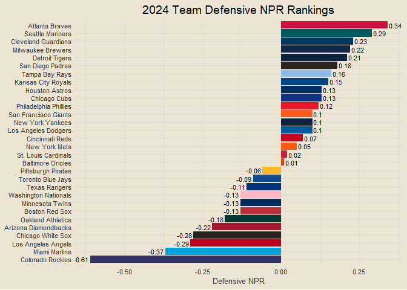
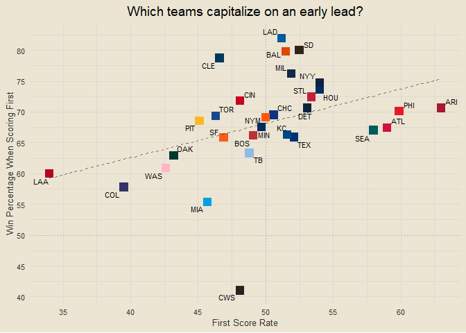
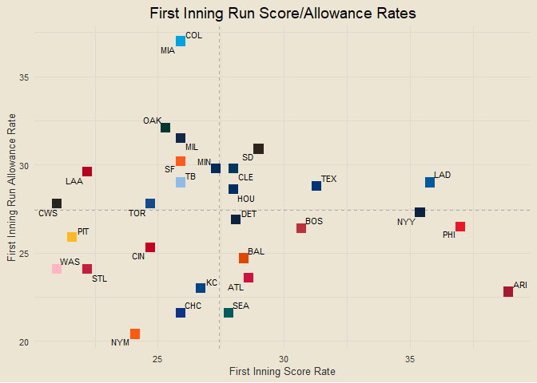

Chad’s 2024 MLB Report
================

*Interested in the underlying code that builds this report?* Check it
out on GitHub:
<a href="https://github.com/chadallison/mlb24" target="_blank">mlb24</a>

------------------------------------------------------------------------

### Contents

- [Team Standings](#team-standings)
- [Team NPR](#team-npr)
- [Total NPR Rankings](#total-npr-rankings)
- [Offensive NPR Rankings](#offensive-npr-rankings)
- [Defensive NPR Rankings](#defensive-npr-rankings)
- [Scorigami](#scorigami)
- [Yesterday’s Largest Victories](#yesterdays-largest-victories)
- [Team Volatility](#team-volatility)
- [Runs Scored per Game](#runs-scored-per-game)
- [One-Run Games](#one-run-games)
- [NPR and Win Percentage](#npr-and-win-percentage)
- [Best Records in Last Ten Games](#best-records-in-last-ten-games)
- [Early Leads](#early-leads)
- [First Score Dependence](#first-score-dependence)
- [Home Field Advantage](#home-field-advantage)
- [Winning and Losing Streaks](#winning-and-losing-streaks)
- [Seven Game Windows](#seven-game-windows)
- [Team Margins in Seven Game
  Windows](#team-margins-in-seven-game-windows)
- [Team Series Results](#team-series-results)
- [Records vs. Above/Below .500
  Teams](#records-vs.-abovebelow-.500-teams)
- [Pythagorean Wins](#pythagorean-wins)
- [Season Long NPR Trends](#season-long-npr-trends)
- [Season Long Pythagorean Trends](#season-long-pythagorean-trends)
- [Runs Scored and Allowed Streaks](#runs-scored-and-allowed-streaks)
- [Team NPR Trends in Past Ten
  Games](#team-npr-trends-in-past-ten-games)
- [First Inning Score Rates](#first-inning-score-rates)
- [One Run vs. Multi Run Games](#one-run-vs.-multi-run-games)

------------------------------------------------------------------------

### Team Standings

<!-- -->

------------------------------------------------------------------------

### Team NPR

<!-- -->

**What is NPR?**

NPR, Naive Performance Rating, is a metric I devised as a measure of
team performance above/below expected. The logic behind it is this: I
calculate each team’s expected runs scored in each game by taking the
average of their runs scored per game and their opponent’s runs allowed
per game. I then compare this expected value to the actual value of runs
scored or allowed to calculate each team’s offensive and defensive NPR
for each game. Here is an example.

Suppose the Cubs are playing the Cardinals. Let’s say the Cubs, on
average, score 4.5 runs per game and allow 3.25 runs per game. And let’s
say the Cardinals score 3.75 runs per game and allow 2.75 runs per game.
We calculate the Cubs’ expected run value as the average of their runs
scored per game and the Cardinals’ runs allowed per game, so (4.5 +
2.75) / 2 = 3.63. We would calculate the Cardinals’ expected run value
the same way, so (3.75 + 3.25) / 2 = 3.5. We now have the Cubs’ expected
run value as 3.63 and the Cardinals’ expected run value as 3.5.

Suppose that the final score of the game is a Cubs victory, 5-3. We
would calculate the Cubs’ offensive NPR as their actual score minus
their expected score: 5 - 3.63 = 1.37. We would calculate their
defensive NPR as the Cardinals’ expected score minus their actual score:
3.5 - 3 = 0.5 (we do it in this order so positive values are good). For
the Cardinals, their offensive NPR is their actual score minus their
expected score, 3 - 3.5 = -0.5, and their defensive NPR is the Cubs’
expected score minus their actual score, 3.63 - 5 = -1.37. Notice how
these numbers are opposite each other. So each team will have an
offensive and defensive NPR for each game, which are aggregated in the
plot below.

Of course, there are so many other factors that would play into a team’s
true expected value, such as any injuries, starting pitchers, weather,
and more. That is why I have named it Naive Performance Rating, because
it assumes matchup metrics are independent of each other and does not
take external factors into account. Which, of course, will lead to flaws
in the metric, but is done for the sake of simplicity and
interpretability.

------------------------------------------------------------------------

### Total NPR Rankings

<!-- -->

------------------------------------------------------------------------

### Offensive NPR Rankings

<!-- -->

------------------------------------------------------------------------

### Defensive NPR Rankings

<!-- -->

------------------------------------------------------------------------

### Scorigami

<!-- -->

------------------------------------------------------------------------

### Yesterday’s Largest Victories

1.  Atlanta Braves def. San Francisco Giants 13-2
2.  New York Mets def. Oakland Athletics 9-1
3.  New York Yankees def. Chicago White Sox 10-2

------------------------------------------------------------------------

### Team Volatility

<!-- -->

##### Most Volatile Teams

1.  Oakland Athletics (6.81)
2.  Colorado Rockies (6.78)
3.  Arizona Diamondbacks (6.77)

##### Most Volatile Offenses

1.  Oakland Athletics (3.64)
2.  Arizona Diamondbacks (3.63)
3.  Minnesota Twins (3.47)

##### Most Volatile Defenses

1.  Colorado Rockies (3.43)
2.  Boston Red Sox (3.34)
3.  Atlanta Braves (3.3)

------------------------------------------------------------------------

### Runs Scored per Game

<!-- -->

------------------------------------------------------------------------

### One-Run Games

<!-- -->

------------------------------------------------------------------------

### NPR and Win Percentage

<!-- -->

------------------------------------------------------------------------

### Best Records in Last Ten Games

1.  Arizona Diamondbacks (9-1)
2.  San Diego Padres (9-1)
3.  Houston Astros (8-2)
4.  Cincinnati Reds (7-3)
5.  Los Angeles Dodgers (7-3)
6.  Baltimore Orioles (6-4)
7.  Detroit Tigers (6-4)
8.  Milwaukee Brewers (6-4)
9.  New York Yankees (6-4)
10. Toronto Blue Jays (6-4)

------------------------------------------------------------------------

### Early Leads

<!-- -->

------------------------------------------------------------------------

### First Score Dependence

<!-- -->

------------------------------------------------------------------------

### Home Field Advantage

<!-- -->

##### Most Home-Dependent Teams

- Colorado Rockies (45.8% home / 27% away)
- Seattle Mariners (58.7% home / 44.8% away)
- San Francisco Giants (56.5% home / 42.6% away)

##### Better-on-the-Road Teams

- Boston Red Sox (47.5% home / 58.6% away)
- New York Yankees (53.4% home / 63.5% away)
- San Diego Padres (53.2% home / 60% away)

------------------------------------------------------------------------

### Winning and Losing Streaks

- **Winning Streaks**: Houston Astros (W8), Arizona Diamondbacks (W6),
  Cleveland Guardians (W5), Cincinnati Reds (W4), Atlanta Braves (W3),
  Detroit Tigers (W3), San Diego Padres (W3), Toronto Blue Jays (W3),
  New York Yankees (W2)
- **Losing Streaks**: Pittsburgh Pirates (L10), San Francisco Giants
  (L4), St. Louis Cardinals (L4), Chicago Cubs (L3), Colorado Rockies
  (L3), Los Angeles Angels (L3), Tampa Bay Rays (L3), Chicago White Sox
  (L2), Seattle Mariners (L2)

<!-- ___ -->
<!-- ### Day of Week Results -->
<!-- ```{r echo = F} -->
<!-- days_of_week = c("Sunday", "Monday", "Tuesday", "Wednesday", "Thursday", "Friday", "Saturday") -->
<!-- ``` -->
<!-- ##### Winners -->
<!-- - -->
<!-- ##### Losers -->
<!-- - -->

------------------------------------------------------------------------

### Seven Game Windows

<!-- -->

------------------------------------------------------------------------

### Team Margins in Seven Game Windows

<!-- -->

------------------------------------------------------------------------

### Team Series Results

<!-- -->

------------------------------------------------------------------------

## Records vs. Above/Below .500 Teams

<!-- -->

------------------------------------------------------------------------

### Pythagorean Wins

<!-- -->

------------------------------------------------------------------------

### Season Long NPR Trends

<!-- -->

------------------------------------------------------------------------

### Season Long Pythagorean Trends

<!-- -->

------------------------------------------------------------------------

### Runs Scored and Allowed Streaks

##### Longest Streaks of Scoring Three or More Runs

- Kansas City Royals (19)
- Arizona Diamondbacks (11)
- Los Angeles Dodgers (7)
- Colorado Rockies (6)
- Cincinnati Reds (4)

##### Longest Streaks of Allowing Fewer Than Five Runs

- Houston Astros (10)
- Detroit Tigers (9)
- Cincinnati Reds (5)
- Arizona Diamondbacks (3)
- Atlanta Braves (3)

------------------------------------------------------------------------

### Team NPR Trends in Past Ten Games

<!-- -->

------------------------------------------------------------------------

### First Inning Score Rates

<!-- -->

------------------------------------------------------------------------

### One Run vs. Multi Run Games

<!-- -->

------------------------------------------------------------------------

``` r
get_npr_last_25 = function(team) {
  return(end_npr |>
    filter(home_team == team | away_team == team) |>
    slice_max(date, n = 25, with_ties = F) |>
    mutate(my_off_npr = ifelse(home_team == team, home_off_npr, away_off_npr),
           my_def_npr = ifelse(home_team == team, home_def_npr, away_def_npr)) |>
    summarise(total_npr = round(sum(my_off_npr + my_def_npr) / 25, 3)) |>
    pull(total_npr))
}

data.frame(team = all_teams) |>
  mutate(last25 = sapply(team, get_npr_last_25)) |>
  arrange(desc(last25))
```

    ##                     team last25
    ## 1   Arizona Diamondbacks  2.070
    ## 2       San Diego Padres  1.970
    ## 3      Oakland Athletics  0.936
    ## 4         Tampa Bay Rays  0.692
    ## 5           Chicago Cubs  0.606
    ## 6      Milwaukee Brewers  0.602
    ## 7          Miami Marlins  0.555
    ## 8        Minnesota Twins  0.548
    ## 9   San Francisco Giants  0.458
    ## 10    Kansas City Royals  0.404
    ## 11   Los Angeles Dodgers  0.271
    ## 12       Cincinnati Reds  0.247
    ## 13        Detroit Tigers  0.210
    ## 14        Houston Astros  0.205
    ## 15         New York Mets  0.122
    ## 16      Seattle Mariners -0.046
    ## 17     Toronto Blue Jays -0.090
    ## 18     Baltimore Orioles -0.104
    ## 19      New York Yankees -0.224
    ## 20      Colorado Rockies -0.262
    ## 21    Los Angeles Angels -0.344
    ## 22    Pittsburgh Pirates -0.348
    ## 23   Cleveland Guardians -0.498
    ## 24  Washington Nationals -0.664
    ## 25        Boston Red Sox -0.746
    ## 26   St. Louis Cardinals -0.758
    ## 27        Atlanta Braves -0.989
    ## 28         Texas Rangers -1.538
    ## 29 Philadelphia Phillies -1.646
    ## 30     Chicago White Sox -2.074
