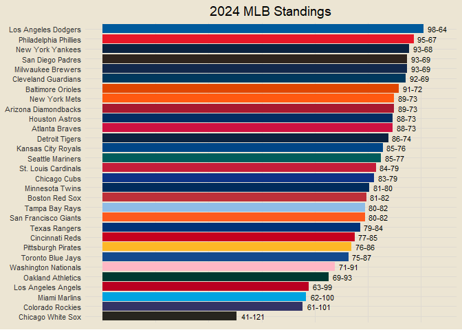

Chad’s 2024 MLB Report
================

Work in progress! :)

------------------------------------------------------------------------

### Contents

- [Team Standings](#team-standings)
- [Team NPR](#team-npr)
- [Total NPR Rankings](#total-npr-rankings)
- [Offensive NPR Rankings](#offensive-npr-rankings)
- [Defensive NPR Rankings](#defensive-npr-rankings)
- [Scorigami](#scorigami)
- [Yesterday’s Largest Victories](#yesterdays-largest-victories)
- [Team Volatility](#team-volatility)
- [Close Game Performance](#close-game-performance)

------------------------------------------------------------------------

### Team Standings

<!-- -->

------------------------------------------------------------------------

### Team NPR

<!-- -->

**What is NPR?**

NPR, Naive Performance Rating, is a metric I devised as a measure of
team performance above/below expected. The logic behind it is this: I
calculate each team’s expected runs scored in each game by taking the
average of their runs scored per game and their opponent’s runs allowed
per game. I then compare this expected value to the actual value of runs
scored or allowed to calculate each team’s offensive and defensive NPR
for each game. Here is an example.

Suppose the Cubs are playing the Cardinals. Let’s say the Cubs, on
average, score 4.5 runs per game and allow 3.25 runs per game. And let’s
say the Cardinals score 3.75 runs per game and allow 2.75 runs per game.
We calculate the Cubs’ expected run value as the average of their runs
scored per game and the Cardinals’ runs allowed per game, so (4.5 +
2.75) / 2 = 3.63. We would calculate the Cardinals’ expected run value
the same way, so (3.75 + 3.25) / 2 = 3.5. We now have the Cubs’ expected
run value as 3.63 and the Cardinals’ expected run value as 3.5.

Suppose that the final score of the game is a Cubs victory, 5-3. We
would calculate the Cubs’ offensive NPR as their actual score minus
their expected score: 5 - 3.63 = 1.37. We would calculate their
defensive NPR as the Cardinals’ expected score minus their actual score:
3.5 - 3 = 0.5 (we do it in this order so positive values are good). For
the Cardinals, their offensive NPR is their actual score minus their
expected score, 3 - 3.5 = -0.5, and their defensive NPR is the Cubs’
expected score minus their actual score, 3.63 - 5 = -1.37. Notice how
these numbers are opposite each other. So each team will have an
offensive and defensive NPR for each game, which are aggregated in the
above plot.

Of course, there are so many other factors that would play into a team’s
true expected value, such as any injuries, starting pitchers, weather,
and more. That is why I have named it Naive Performance Rating, because
it assumes matchup metrics are independent of each other and does not
take external factors into account. Which, of course, will lead to flaws
in the metric, but is done for the sake of simplicity and
interpretability (which is ironic because I expect it is still difficult
to interpret for others than myself).

------------------------------------------------------------------------

### Total NPR Rankings

<!-- -->

------------------------------------------------------------------------

### Offensive NPR Rankings

<!-- -->

------------------------------------------------------------------------

### Defensive NPR Rankings

<!-- -->

------------------------------------------------------------------------

### Scorigami

<!-- -->

------------------------------------------------------------------------

### Yesterday’s Largest Victories

1.  Arizona Diamondbacks def. San Francisco Giants 17-1
2.  Cleveland Guardians def. Oakland Athletics 10-2
3.  Boston Red Sox def. Pittsburgh Pirates 8-1

------------------------------------------------------------------------

### Team Volatility

<!-- -->

##### Most Volatile Teams

1.  Arizona Diamondbacks (7.6)
2.  Chicago Cubs (7.09)
3.  Colorado Rockies (7.05)

##### Most Volatile Offenses

1.  Arizona Diamondbacks (4.35)
2.  Kansas City Royals (4.12)
3.  San Diego Padres (4.04)

##### Most Volatile Defenses

1.  San Francisco Giants (4.16)
2.  Los Angeles Angels (3.87)
3.  Chicago Cubs (3.71)

------------------------------------------------------------------------

### Close Game Performance

<!-- -->

------------------------------------------------------------------------

*Interested in the underlying code that builds this report?* Check it
out on GitHub:
<a href="https://github.com/chadallison/mlb24" target="_blank">mlb24</a>

``` r
team_npr |>
  mutate(off_rk = rank(-off_npr),
         def_rk = rank(-def_npr)) |>
  filter(off_rk <= 10 & def_rk <= 10)
```

    ##                   team off_npr def_npr total_npr off_rk def_rk
    ## 1        New York Mets    0.46    0.53      0.99      7    1.0
    ## 2    Milwaukee Brewers    0.59    0.28      0.87      4    5.5
    ## 3 Arizona Diamondbacks    0.43    0.10      0.53      8   10.0

``` r
team_rspg |>
  distinct(team, runs_scored_per_game, runs_allowed_per_game) |>
  mutate(rs_rank = rank(-runs_scored_per_game),
         ra_rank = rank(runs_allowed_per_game)) |>
  filter(rs_rank <= 10 & ra_rank <= 10)
```

    ##                  team runs_scored_per_game runs_allowed_per_game rs_rank
    ## 1 Cleveland Guardians                 5.60                  3.35       5
    ## 2  Kansas City Royals                 5.05                  2.80       9
    ## 3   Milwaukee Brewers                 5.56                  4.11       6
    ## 4       New York Mets                 5.05                  4.05       9
    ##   ra_rank
    ## 1       2
    ## 2       1
    ## 3      10
    ## 4       8
