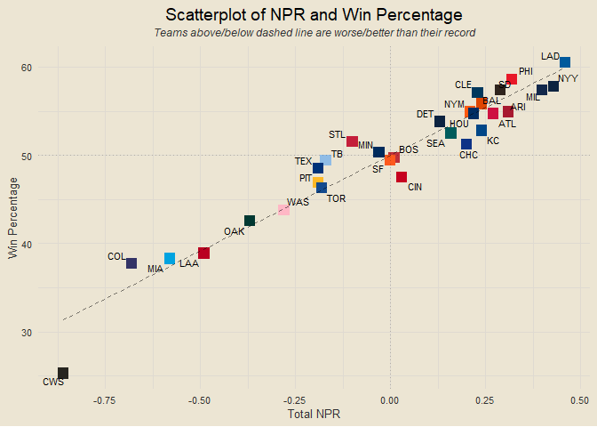
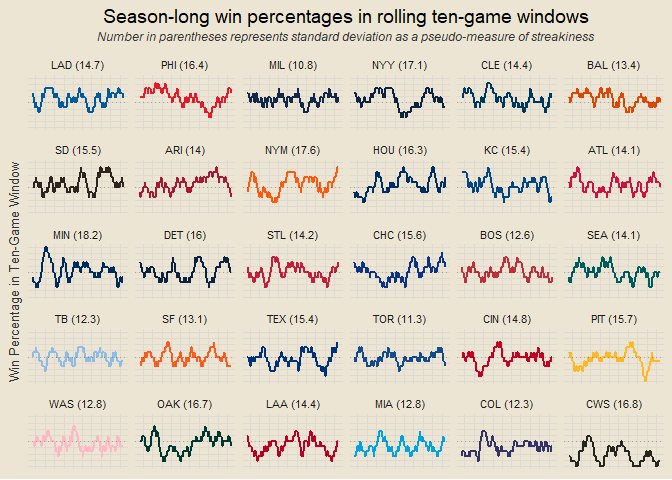

Chad’s 2024 MLB Report
================

*Interested in the underlying code that builds this report?* Check it
out on GitHub:
<a href="https://github.com/chadallison/mlb24" target="_blank">mlb24</a>

------------------------------------------------------------------------

### Contents

- [Team Standings](#team-standings)
- [Team NPR](#team-npr)
- [Total NPR Rankings](#total-npr-rankings)
- [Offensive NPR Rankings](#offensive-npr-rankings)
- [Defensive NPR Rankings](#defensive-npr-rankings)
- [Scorigami](#scorigami)
- [Yesterday’s Largest Victories](#yesterdays-largest-victories)
- [Team Volatility](#team-volatility)
- [Runs Scored per Game](#runs-scored-per-game)
- [One-Run Games](#one-run-games)
- [NPR and Win Percentage](#npr-and-win-percentage)
- [Best Records in Last Ten Games](#best-records-in-last-ten-games)
- [Early Leads](#early-leads)
- [First Score Dependence](#first-score-dependence)
- [Home Field Advantage](#home-field-advantage)
- [Winning and Losing Streaks](#winning-and-losing-streaks)
- [Seven Game Windows](#seven-game-windows)
- [Team Margins in Seven Game
  Windows](#team-margins-in-seven-game-windows)
- [Team Series Results](#team-series-results)
- [Records vs. Above/Below .500
  Teams](#records-vs.-abovebelow-.500-teams)
- [Pythagorean Wins](#pythagorean-wins)
- [Season Long NPR Trends](#season-long-npr-trends)
- [Season Long Pythagorean Trends](#season-long-pythagorean-trends)
- [Runs Scored and Allowed Streaks](#runs-scored-and-allowed-streaks)
- [Team NPR Trends in Past Ten
  Games](#team-npr-trends-in-past-ten-games)
- [First Inning Score Rates](#first-inning-score-rates)
- [One Run vs. Multi Run Games](#one-run-vs.-multi-run-games)
- [Rolling Ten-Game Windows](#rolling-ten-game-windows)

------------------------------------------------------------------------

### Team Standings

<!-- -->

------------------------------------------------------------------------

### Team NPR

<!-- -->

**What is NPR?**

NPR, Naive Performance Rating, is a metric I devised as a measure of
team performance above/below expected. The logic behind it is this: I
calculate each team’s expected runs scored in each game by taking the
average of their runs scored per game and their opponent’s runs allowed
per game. I then compare this expected value to the actual value of runs
scored or allowed to calculate each team’s offensive and defensive NPR
for each game. Here is an example.

Suppose the Cubs are playing the Cardinals. Let’s say the Cubs, on
average, score 4.5 runs per game and allow 3.25 runs per game. And let’s
say the Cardinals score 3.75 runs per game and allow 2.75 runs per game.
We calculate the Cubs’ expected run value as the average of their runs
scored per game and the Cardinals’ runs allowed per game, so (4.5 +
2.75) / 2 = 3.63. We would calculate the Cardinals’ expected run value
the same way, so (3.75 + 3.25) / 2 = 3.5. We now have the Cubs’ expected
run value as 3.63 and the Cardinals’ expected run value as 3.5.

Suppose that the final score of the game is a Cubs victory, 5-3. We
would calculate the Cubs’ offensive NPR as their actual score minus
their expected score: 5 - 3.63 = 1.37. We would calculate their
defensive NPR as the Cardinals’ expected score minus their actual score:
3.5 - 3 = 0.5 (we do it in this order so positive values are good). For
the Cardinals, their offensive NPR is their actual score minus their
expected score, 3 - 3.5 = -0.5, and their defensive NPR is the Cubs’
expected score minus their actual score, 3.63 - 5 = -1.37. Notice how
these numbers are opposite each other. So each team will have an
offensive and defensive NPR for each game, which are aggregated in the
plot below.

Of course, there are so many other factors that would play into a team’s
true expected value, such as any injuries, starting pitchers, weather,
and more. That is why I have named it Naive Performance Rating, because
it assumes matchup metrics are independent of each other and does not
take external factors into account. Which, of course, will lead to flaws
in the metric, but is done for the sake of simplicity and
interpretability.

------------------------------------------------------------------------

### Total NPR Rankings

<!-- -->

------------------------------------------------------------------------

### Offensive NPR Rankings

<!-- -->

------------------------------------------------------------------------

### Defensive NPR Rankings

<!-- -->

------------------------------------------------------------------------

### Scorigami

<!-- -->

------------------------------------------------------------------------

### Yesterday’s Largest Victories

1.  Chicago Cubs def. Washington Nationals 14-1
2.  Arizona Diamondbacks def. Los Angeles Dodgers 14-3
3.  St. Louis Cardinals def. New York Yankees 14-7

------------------------------------------------------------------------

### Team Volatility

<!-- -->

##### Most Volatile Teams

1.  Arizona Diamondbacks (6.76)
2.  Oakland Athletics (6.74)
3.  Colorado Rockies (6.7)

##### Most Volatile Offenses

1.  Arizona Diamondbacks (3.66)
2.  Oakland Athletics (3.55)
3.  Chicago Cubs (3.4)

##### Most Volatile Defenses

1.  Colorado Rockies (3.41)
2.  Pittsburgh Pirates (3.37)
3.  Boston Red Sox (3.29)

------------------------------------------------------------------------

### Runs Scored per Game

<!-- -->

------------------------------------------------------------------------

### One-Run Games

<!-- -->

------------------------------------------------------------------------

### NPR and Win Percentage

<!-- -->

------------------------------------------------------------------------

### Best Records in Last Ten Games

1.  Chicago Cubs (9-1)
2.  Detroit Tigers (8-2)
3.  Los Angeles Dodgers (7-3)
4.  Milwaukee Brewers (7-3)
5.  New York Mets (7-3)
6.  Philadelphia Phillies (7-3)
7.  Texas Rangers (7-3)
8.  Arizona Diamondbacks (6-4)
9.  Atlanta Braves (6-4)
10. Houston Astros (6-4)

------------------------------------------------------------------------

### Early Leads

<!-- -->

------------------------------------------------------------------------

### First Score Dependence

<!-- -->

------------------------------------------------------------------------

### Home Field Advantage

<!-- -->

##### Most Home-Dependent Teams

- Colorado Rockies (46.4% home / 27.5% away)
- Seattle Mariners (59.4% home / 41.2% away)
- San Francisco Giants (56.5% home / 42% away)

##### Better-on-the-Road Teams

- Boston Red Sox (44.3% home / 57.4% away)
- New York Yankees (53.7% home / 60.9% away)
- San Diego Padres (53.6% home / 58.6% away)

------------------------------------------------------------------------

### Winning and Losing Streaks

- **Winning Streaks**: Chicago Cubs (W6), Houston Astros (W5), New York
  Mets (W4), Detroit Tigers (W2), Los Angeles Angels (W2), Miami Marlins
  (W2), Philadelphia Phillies (W2), St. Louis Cardinals (W2), Texas
  Rangers (W2)
- **Losing Streaks**: Chicago White Sox (L11), Kansas City Royals (L5),
  Washington Nationals (L3), Atlanta Braves (L2), Boston Red Sox (L2),
  New York Yankees (L2), Oakland Athletics (L2), San Francisco Giants
  (L2), Seattle Mariners (L2)

<!-- ___ -->
<!-- ### Day of Week Results -->
<!-- ```{r echo = F} -->
<!-- days_of_week = c("Sunday", "Monday", "Tuesday", "Wednesday", "Thursday", "Friday", "Saturday") -->
<!-- ``` -->
<!-- ##### Winners -->
<!-- - -->
<!-- ##### Losers -->
<!-- - -->

------------------------------------------------------------------------

### Seven Game Windows

<!-- -->

------------------------------------------------------------------------

### Team Margins in Seven Game Windows

<!-- -->

------------------------------------------------------------------------

### Team Series Results

<!-- -->

------------------------------------------------------------------------

## Records vs. Above/Below .500 Teams

<!-- -->

------------------------------------------------------------------------

### Pythagorean Wins

<!-- -->

------------------------------------------------------------------------

### Season Long NPR Trends

<!-- -->

------------------------------------------------------------------------

### Season Long Pythagorean Trends

<!-- -->

------------------------------------------------------------------------

### Runs Scored and Allowed Streaks

##### Longest Streaks of Scoring Three or More Runs

- Milwaukee Brewers (10)
- Baltimore Orioles (9)
- St. Louis Cardinals (8)
- Chicago Cubs (6)
- Houston Astros (5)

##### Longest Streaks of Allowing Fewer Than Five Runs

- Milwaukee Brewers (6)
- Houston Astros (5)
- Toronto Blue Jays (5)
- New York Mets (4)
- Atlanta Braves (3)

------------------------------------------------------------------------

### Team NPR Trends in Past Ten Games

<!-- -->

------------------------------------------------------------------------

### First Inning Score Rates

<!-- -->

------------------------------------------------------------------------

### One Run vs. Multi Run Games

<!-- -->

------------------------------------------------------------------------

``` r
get_npr_last_25 = function(team) {
  return(end_npr |>
    filter(home_team == team | away_team == team) |>
    slice_max(date, n = 25, with_ties = F) |>
    mutate(my_off_npr = ifelse(home_team == team, home_off_npr, away_off_npr),
           my_def_npr = ifelse(home_team == team, home_def_npr, away_def_npr)) |>
    summarise(total_npr = round(sum(my_off_npr + my_def_npr) / 25, 3)) |>
    pull(total_npr))
}

data.frame(team = all_teams) |>
  mutate(last25 = sapply(team, get_npr_last_25)) |>
  arrange(desc(last25))
```

    ##                     team last25
    ## 1           Chicago Cubs  1.821
    ## 2   Arizona Diamondbacks  1.693
    ## 3         Houston Astros  1.629
    ## 4      Toronto Blue Jays  1.555
    ## 5         Detroit Tigers  1.402
    ## 6      Milwaukee Brewers  1.336
    ## 7         Atlanta Braves  0.426
    ## 8    Los Angeles Dodgers  0.374
    ## 9  Philadelphia Phillies  0.249
    ## 10     Oakland Athletics  0.118
    ## 11      San Diego Padres  0.048
    ## 12   St. Louis Cardinals  0.007
    ## 13         New York Mets -0.071
    ## 14    Kansas City Royals -0.321
    ## 15      Seattle Mariners -0.331
    ## 16      Colorado Rockies -0.414
    ## 17     Baltimore Orioles -0.425
    ## 18  San Francisco Giants -0.444
    ## 19  Washington Nationals -0.462
    ## 20        Tampa Bay Rays -0.504
    ## 21       Minnesota Twins -0.514
    ## 22   Cleveland Guardians -0.541
    ## 23      New York Yankees -0.705
    ## 24    Los Angeles Angels -0.722
    ## 25     Chicago White Sox -0.733
    ## 26         Texas Rangers -0.884
    ## 27        Boston Red Sox -1.080
    ## 28         Miami Marlins -1.105
    ## 29       Cincinnati Reds -1.223
    ## 30    Pittsburgh Pirates -1.458

------------------------------------------------------------------------

### Rolling Ten-Game Windows

<!-- -->

``` r
get_team_all_pythag = function(tm) {
  data = end_games |>
    filter(home_team == tm | away_team == tm) |>
    mutate(my_score = ifelse(home_team == tm, home_score, away_score),
           other_score = ifelse(home_team == tm, away_score, home_score),
           pythag = (my_score ^ 2) / (my_score ^ 2 + other_score ^ 2)) |>
    transmute(team = tm, date, pythag)
  
  return(data)
}

pythag = data.frame()

for (team in all_teams) {
  new = get_team_all_pythag(tm = team)
  pythag = rbind(pythag, new)
}

hex_pct_ordered = team_records |>
  inner_join(teams_info, by = "team") |>
  arrange(desc(pct)) |>
  pull(hex)

pythag |>
  group_by(team) |>
  mutate(roll = rollapply(pythag, width = 10, FUN = "mean", align = "right", fill = NA)) |>
  ungroup() |>
  na.omit() |>
  inner_join(teams_info, by = "team") |>
  inner_join(team_records, by = "team") |>
  mutate(abb = fct_reorder(abb, -pct)) |>
  ggplot(aes(date, roll)) +
  geom_line(aes(col = abb), linewidth = 1.25, show.legend = F) +
  # geom_line(stat = "smooth", formula = y ~ x, method = "loess", se = F) +
  geom_hline(yintercept = 0.5, linetype = "dashed", alpha = 0.5) +
  scale_color_manual(values = hex_pct_ordered) +
  facet_wrap(vars(abb)) +
  theme(axis.text = element_blank()) +
  labs(x = NULL, y = "Pythagorean Win Percentage",
       title = "Season-long pythagorean win percentage in ten-game rolling windows",
       subtitle = "Average of individual games method")
```

<!-- -->

``` r
get_team_runs_scored_on = function(tm, dt) {
  data = end_games |> filter((home_team == tm | away_team == tm) & date == dt)
  if (nrow(data) == 0) return(NA)
  runs = data |> mutate(runs = ifelse(home_team == tm, home_score, away_score)) |> pull(runs)
  return(sum(runs))
}

get_team_runs_allowed_on = function(tm, dt) {
  data = end_games |> filter((home_team == tm | away_team == tm) & date == dt)
  if (nrow(data) == 0) return(NA)
  runs = data |> mutate(runs = ifelse(home_team == tm, away_score, home_score)) |> pull(runs)
  return(sum(runs))
}

# this took 17s to run on 2024/08/24
scored_allowed_on_dates = crossing(team = all_teams, date = all_szn_dates) |>
  rowwise() |>
  mutate(scored = get_team_runs_scored_on(tm = team, dt = date),
         allowed = get_team_runs_allowed_on(tm = team, dt = date)) |>
  ungroup() |>
  na.omit()

scored_allowed_on_dates |>
  mutate(roll_score = rollapply(scored, width = 10, FUN = "sum", align = "right", fill = NA),
         roll_allow = rollapply(allowed, width = 10, FUN = "sum", align = "right", fill = NA),
         pythag = (roll_score ^ 2) / (roll_score ^ 2 + roll_allow ^ 2)) |>
  na.omit() |>
  inner_join(teams_info, by = "team") |>
  inner_join(team_records, by = "team") |>
  mutate(abb = fct_reorder(abb, -pct)) |>
  ggplot(aes(date, pythag)) +
  geom_line(aes(col = abb), linewidth = 1.25, show.legend = F) +
  # geom_line(stat = "smooth", formula = y ~ x, method = "loess", se = F) +
  geom_hline(yintercept = 0.5, linetype = "dashed", alpha = 0.5) +
  scale_color_manual(values = hex_pct_ordered) +
  facet_wrap(vars(abb)) +
  theme(axis.text = element_blank()) +
  labs(x = NULL, y = "Pythagorean Win Percentage in Ten-Game Window",
       title = "Season-long pythagorean win percentages in rolling ten-game windows")
```

<!-- -->

``` r
data.frame(team = all_teams) |>
  mutate(rs = sapply(team, get_team_runs_scored),
         ra = sapply(team, get_team_runs_allowed),
         py = round((rs ^ 2) / (rs ^ 2 + ra ^ 2) * 100, 2),
         rank = as.integer(rank(-py))) |>
  arrange(rank)
```

    ##                     team  rs  ra    py rank
    ## 1      Milwaukee Brewers 668 535 60.92    1
    ## 2       New York Yankees 691 573 59.25    2
    ## 3  Philadelphia Phillies 659 549 59.03    3
    ## 4    Los Angeles Dodgers 683 571 58.86    4
    ## 5         Houston Astros 628 539 57.58    5
    ## 6     Kansas City Royals 661 569 57.44    6
    ## 7   Arizona Diamondbacks 743 646 56.95    7
    ## 8      Baltimore Orioles 685 600 56.59    8
    ## 9    Cleveland Guardians 624 552 56.10    9
    ## 10      San Diego Padres 664 597 55.30   10
    ## 11        Atlanta Braves 580 528 54.68   11
    ## 12          Chicago Cubs 626 574 54.33   12
    ## 13       Minnesota Twins 640 598 53.39   13
    ## 14         New York Mets 651 610 53.25   14
    ## 15        Detroit Tigers 577 548 52.58   15
    ## 16      Seattle Mariners 544 520 52.25   16
    ## 17       Cincinnati Reds 616 605 50.90   17
    ## 18        Boston Red Sox 659 654 50.38   18
    ## 19  San Francisco Giants 587 607 48.33   19
    ## 20         Texas Rangers 571 614 46.38   20
    ## 21     Toronto Blue Jays 590 638 46.10   21
    ## 22   St. Louis Cardinals 575 625 45.84   22
    ## 23    Pittsburgh Pirates 572 622 45.82   23
    ## 24        Tampa Bay Rays 527 592 44.21   24
    ## 25     Oakland Athletics 560 633 43.90   25
    ## 26  Washington Nationals 575 650 43.90   25
    ## 27    Los Angeles Angels 535 662 39.51   27
    ## 28         Miami Marlins 520 705 35.23   28
    ## 29      Colorado Rockies 591 802 35.19   29
    ## 30     Chicago White Sox 421 705 26.29   30
